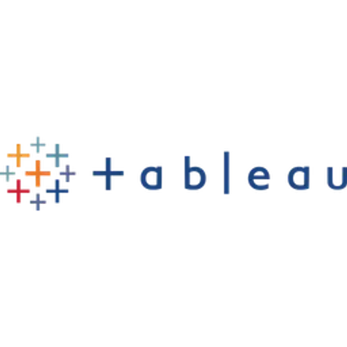

<!-- ============================================ -->
<!--    MALARAJU YASWANTH VARMA - PORTFOLIO      -->
<!--    Built and Crafted with ❤️ as a Portfolio Web Page     -->
<!-- ============================================ -->
<!-- ═══════════════ 🇮🇳 HEADER BANNER ═══════════════ -->

  

<!-- ═══════════════ 🏠 HERO SECTION ═══════════════ -->
 

<!-- Profile Photo -->

 

<!-- Name & Title -->
<h1>Hi, I'm Yaswanth Varma 👋</h1>
<h3>Data Analyst | BI Developer | Python Enthusiast</h3>

<!-- Typing Animation -->

 

<!-- Resume Download Button -->

&nbsp;&nbsp;&nbsp;&nbsp;

&nbsp;&nbsp;&nbsp;&nbsp;

&nbsp;&nbsp;&nbsp;&nbsp;

&nbsp;&nbsp;

&nbsp;&nbsp;

 

<!-- ═══════════════ 📌 NAVIGATION BAR ═══════════════ -->

| [👤 About](#-about-me) | [🛠️ Skills](#️-skills) | [💼 Projects](#-projects) | [📬 Contact](#-contact) |
|:---:|:---:|:---:|:---:|:---:|

 

<!-- ═══════════════ 👤 ABOUT ME ═══════════════ -->

## 👤 About Me

> *"I don't just analyze data — I tell stories with it."*

I'm **Malaraju Yaswanth Varma**, a passionate **Data Analyst** who loves transforming messy, raw data into **clear, actionable insights**. 

My journey in data started with curiosity — *"What can these numbers actually tell us?"* — and grew into a mission to help businesses make **smarter, data-driven decisions**.

### 🎯 What I Do

| 📊 Data Analysis | 📈 Dashboards | 🐍 Automation | 🌐 Web Dev |
|:---:|:---:|:---:|:---:|
| Cleaning, transforming & analyzing data | Building interactive BI dashboards | Writing Python scripts to automate tasks | Creating web-based data solutions |

### 🔥 Currently

- 🚀 Building **OptiStock** — Supply Chain Analytics Platform
- 🧠 Learning **Advanced ML & Time-Series Forecasting**
- 📊 Exploring **Tableau** for advanced visualizations

 

---
<!-- ═══════════════ 🛠️ SKILLS ═══════════════ -->

## 🛠️ Skills

### 🐍 Languages & Databases

 

### 🌐 Web Development

 

### 📊 BI & Visualization
<!-- Using SimpleIcons for raw, clean logos that match the style above -->

 

### 🧰 Tools & Platforms

---

<!-- ═══════════════ 💼 PROJECTS ═══════════════ -->

## 💼 Projects

### 🏆 Featured Work

| | |
|:---:|:---|
| 🚚 | **OptiStock Supply Chain**   End-to-end supply chain analytics & demand forecasting   `Python` `SQL` `Power BI` |
| 🏦 | **YoursBank Financial Dashboard**   Comprehensive banking dashboard with risk & portfolio metrics   `Power BI` |
| 🚗 | **Indian Road Accident Analysis**   Visual insights & trend analysis on national safety data   `Excel` |
| 🏥 | **Healthcare Predictive Analytics**   Predictive modeling for patient outcomes   `Python` |
| 🌐 | **Personal Portfolio Website**   Responsive, modern portfolio (you're looking at the README version!)   `HTML` `CSS` `JavaScript` |

 

---

<!-- ═══════════════ 📬 CONTACT ═══════════════ -->

## 📬 Contact

### 📖 Every dataset has a story waiting to be told.

Whether you need to uncover hidden trends, automate the mundane, or build a dashboard that drives real decisions—**let's write that story together.**

 

<!-- Minimalist Raw Colored Logos -->

&nbsp;&nbsp;

&nbsp;&nbsp;

&nbsp;&nbsp;

&nbsp;&nbsp;

 
 

 
 

<b>⭐ Thanks for visiting my profile!⭐</b>

 

<!-- Indian Flag Color Footer Flow -->

  

